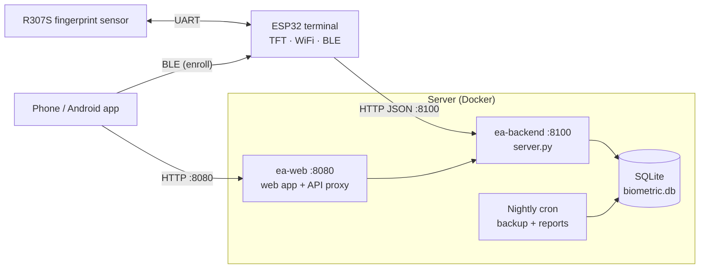

# Employees Access — Fingerprint Attendance System

A fingerprint attendance and access system for a small office. Employees scan a
finger on an ESP32 terminal; the server records a punch **IN** or **OUT** and
builds daily attendance. Admins manage employees, enroll fingers, set holidays
and download reports from a phone web app or an Android app.



## Features

- Fingerprint punch in/out with alternating IN → OUT per day; repeat scans within 30 s are ignored
- Enrollment from a phone over Bluetooth LE, secured by a passkey shown on the terminal
- Attendance per day: first in, last out, worked time, absent / present / off, missed punch-outs
- Weekends and holidays calendar
- CSV exports (logs, employees, attendance, punches) and nightly saved reports
- Live-updating admin web app (installable PWA) plus an Android app with native BLE
- Password-protected admin login; nightly database backups kept for 30 days

## Repository layout

| Path | What it is |
| --- | --- |
| `firmware/hello_world/` | ESP32 terminal firmware (ESP-IDF): sensor, TFT, WiFi, BLE enrollment |
| `firmware/tft_test/` | Standalone display test |
| `backend/server.py` | API server — Python standard library + SQLite, no dependencies |
| `phone/` | Admin web app (HTML/CSS/JS, service worker) and `serve.py` static server + API proxy |
| `android/` | Android WebView app with a native Bluetooth bridge; `build.sh` builds the APK without Gradle |
| `deploy/` | Docker Compose, install script, nightly backup and report jobs ([deploy/README.md](deploy/README.md)) |
| `docs/` | Full project guide (PDF) |

## Hardware

| Part | Connection |
| --- | --- |
| ESP32 (4 MB flash) | — |
| R307S fingerprint sensor | UART2: TX GPIO17, RX GPIO16, 57600 baud |
| 240×320 SPI TFT | SCLK 18, MOSI 23, MISO 19, CS 5, DC 21, RESET 22 |

## Getting started

### 1. Run the server

Needs Docker with Compose.

```sh
cd deploy
./install.sh          # starts both services and installs the nightly jobs
python3 ../backend/server.py --set-password   # set the admin password
```

- Web app: `http://<server-ip>:8080`
- Terminal API: `http://<server-ip>:8100`

Without Docker:

```sh
python3 backend/server.py --port 8100
python3 phone/serve.py --port 8080 --backend http://127.0.0.1:8100
```

### 2. Flash the terminal

Needs [ESP-IDF](https://docs.espressif.com/projects/esp-idf/) v6.x.

```sh
cd firmware/hello_world/main
cp secrets.h.example secrets.h      # set WIFI_SSID and WIFI_PASSWORD
# set SERVER_BASE_URL and DEVICE_ID in hello_world_main.c
cd ..
idf.py set-target esp32
idf.py build
idf.py -p /dev/ttyUSB0 flash monitor
```

### 3. Build the Android app (optional)

Needs the Android SDK build tools and a JDK.

```sh
cd android
echo 'KEY_PASS=choose-a-password' > signing.env   # not committed
./build.sh                                        # → build/employees-access.apk
cp build/employees-access.apk ../phone/download/  # offer it for download
```

Keep `release.keystore` safe: updates only install over the old app when signed with the same key.

## How it works

1. **Add an employee** in the web app (code, name, department).
2. **Enroll** — in the Enroll tab, connect to the terminal over Bluetooth, pick the employee and finger, and scan it twice. The server assigns a sensor slot; the template stays inside the sensor.
3. **Punch** — the terminal matches the finger, sends the slot to `POST /api/v1/access-events`, and shows the name with IN or OUT (and worked time on OUT).
4. **Report** — the Attendance tab shows each day; CSVs are saved nightly to `reports/`.

## API

Terminal endpoints (no login): `POST /api/v1/devices/heartbeat`, `/enrollment/start`,
`/enrollment/complete`, `/access-events`; `GET /health`.

Admin endpoints (session cookie from `POST /api/v1/auth/login`): employees, logs,
attendance, calendar and holidays, CSV exports, saved reports, and a live-update
long-poll at `/api/v1/changes`. The full list is at the top of
[backend/server.py](backend/server.py).

## Not in this repo

These stay on the server and are listed in `.gitignore`:

- `backend/biometric.db`, `backups/`, `reports/` — live data
- `firmware/**/secrets.h`, `android/signing.env`, `*.keystore` — credentials and signing key
- `tools/esp/esp-idf/` — the ESP-IDF toolchain

## Author

Arjune
